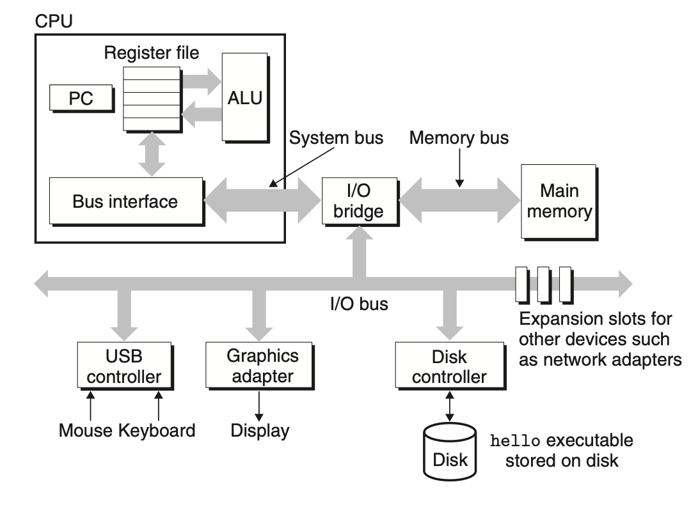

# 1-4 Processors Read and Interpret Instructions Stored in Memory

hello.c 소스코드는 컴파일 시스템을 통해 executable object file인 hello로 컴파일되어, 디스크에 저장된다. Unix 시스템에서 실행파일을 실행하려면, shell에 아래와 같이 파일 이름을 입력한다.

```shell
linux> ./hello
hello, world
linux>
```

shell은 프롬프트를 출력하는 명령줄 해석기로, 우리가 명령어를 입력하길 기다리다가 명령어를 실행한다.
입력한 명령어가 shell 내장 명령어가 아니면, 명령어가 실행파일의 이름이라고 가정하고 메모리에 적재한 다음 실행한다.
이 경우엔 shell은 hello 프로그램이 끝날 때까지 기다린다.
hello 프로그램은 메시지를 스크린에 출력하고 종료한다.
shell은 프롬프트를 출력하고, 다음 명령어 입력을 기다린다.



Figure 1-4) **Hardware orgnaization of a typical system.**
CPU: central processing unit,
ALU: arithmetic/logic unit,
PC: program counter,
USB: universal serial bus

#### 1.4.1 Hardware Organization of a System

1. Buses

   1. electrical conduits
   2. 컴포넌트 사이에서 바이트 단위 정보를 전달함
   3. 워드(word) : 고정 크기의 바이트 덩어리(chunk)
   4. 워드는 시스템마다 4바이트(32bit), 8바이트(64) 등으로 달라짐

2. I/O Devices

   1. I/O device는 외부 세계와 시스템의 연결
   2. 그림에는 4개의 I/O 장치가 있음 : 키보드, 마우스, 디스플레이, 디스크
   3. 각 I/O 장치는 **controller**나 **adapter**에 의해 I/O bus에 연결됨
      - controller/adapter 차이는 주로 패키징일 뿐임
   4. controller는 장치 내장이거나 motherboard에 있는 칩셋의 일종
   5. adapter는 motherboard의 슬롯에 꽂는 카드 형태
   6. 둘 다 목적은 I/O 버스와 I/O 장치 사이에서 정보를 전달하는 것
   7. chapter 6에서 I/O장치가 작동하는 법, chatper 10에서 Unix I/O 인터페이스 사용하는 법 학습
   8. network 같이 중요한 디바이스 다룰 예정

3. Main Memory
4. Processor
5.
