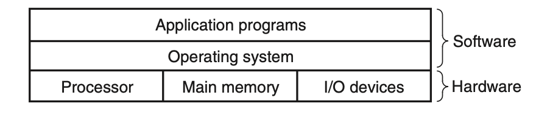
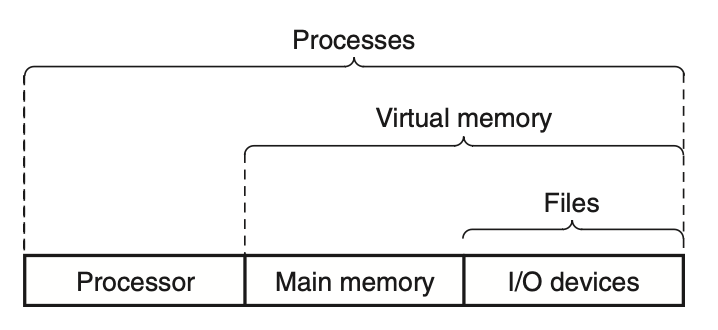

# 1-7. The Operating System Manages the Hardware

#### Overview

1. 운영체제 : 응용프로그램과 하드웨어 사이에 위치한 소프트웨어 계층

   

   Figure 1.10) 컴퓨터 시스템의 계층화된 관점

   - 쉘이 `hello` 프로그램 로드, 실행
   - `hello` 프로그램이 메시지 출력
   - 모든 경우에 프로그램은 키보드, 디스플레이, 디스크, 메인메모리에 직접 접근하지 않음
   - 대신 운영체제가 제공하는 서비스를 이용
   - 하드웨어를 조작하려는 응용 프로그램의 시도는 모두 운영체제를 거쳐야 함

2. 운영체제의 주요 목적

   - 제멋대로 실행되는 응용 프로그램(runaway application)이 하드웨어를 오용하지 못하게 보호하기
   - 응용 프로그램에 저수준 하드웨어 장치를 조작하기 위한 단순 + 일관된 메커니즘 제공하기
     - 저수준 하드웨어 장치는 복잡하고, 서로 매우 다르기 때문

3. 운영체제가 제공하는 추상화 : process, virtual memory, files
   

   Figure 1.11) 운영체제가 제공하는 추상화

   - 파일(files) : 입출력 장치(I/O devices) 추상화
   - 가상 메모리(virtual memory) : 주기억장치(main memory), 입출력 장치 추상화
   - 프로세스(process) : 프로세서(processor), 주기억장치, 입출력 장치 추상화

#### 1.7.1 Processes

1. 프로세스
   1. 실행 중인 프로그램에 대해 운영체제가 제공하는 추상화
   2. 프로그램이 프로세서, 주기억장치, 입출력 장치를 독점적으로 사용하는 것 같은 착각 제공
   3. 하나의 시스템에서는 여러 프로세스가 동시에 실행 가능
   4. 각 프로세스는 마치 하드웨러를 독점적으로 사용하는 것처럼 보임
2. 동시성
   1. 한 프로세스의 명령어들과 다른 프로세스의 명령어들이 서로 섞여서(interleaved) 실행된다는 것
   2. 대부분 시스템에선 실행해야 하는 프로세스 수가 CPU 수보다 많음

#### 1.7.2 Threads

#### 1.7.3 Virtual Memory

#### 1.7.4 Files

#### Aside - Unix, Posix, and the Standard Unix Specification

1. 1960년대 : 복잡한 운영체제(OS/360, Multics)

   - OS/360은 성공적이었지만 Multics는 실패

2. Unix

   - Bell 연구소
   - Multics 프로젝트의 복잡성, 지지부진함으로 프로젝트 탈퇴
   - PDP-7 컴퓨터를 위한 운영체제 기계어로 작성하기 시작
   - 계층적 파일 시스템, 셸 등의 개념을 Multics에서 차용 + 더 작고 단순하게 개량
   - 커널을 C 언어로 다시 작성하고 외부에 공식 발표

3. 새로운 Unix

   - Unix는 느슨한 조건으로 소스코드를 대학에 공개함
   - Unix 4.xBSD : Berkeley 대학에서 가상메모리, 인터넷 프로토콜 추가
   - System V Unix (Bell)
   - Solaris (Sun Microsystems) : BSD, System V에서 파생된 유닉스 버전

4. Posix 표준
   - Unix 벤더들이 자사 제품 차별화 위해 호환되지 않는 기능 추가하면서 문제 발생
   - IEEE에서 Unix 표준화 주도 - Richard Stallman이 Posix라고 명명
   - Unix 시스템 콜을 위한 C 언어 인터페이스, 셸 프로그램 및 유틸리티, 스레드, 네트워크 프로그래밍 포함
   - 최근에는 Standard Unix Specification이 Posix와 통합 -> Unix 시스템 위한 통합 표준 형성
